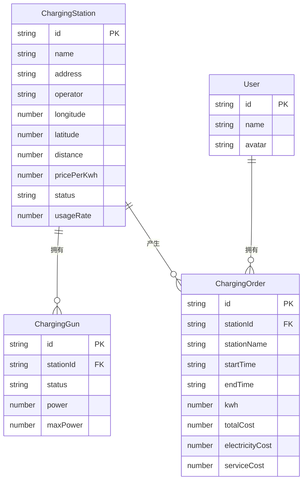

## 1. 架构设计

```mermaid
flowchart TD
    "用户界面层(View)" --> "组件层(Components)"
    "组件层(Components)" --> "状态管理层(Pinia Store)"
    "状态管理层(Pinia Store)" --> "Mock数据层(Mock Data)"
    "组件层(Components)" --> "路由层(Vue Router)"
    "组件层(Components)" --> "UI组件库(Naive UI)"
    "组件层(Components)" --> "图表库(ECharts)"
    "样式层(全局样式+响应式CSS)" --> "用户界面层(View)"
```

## 2. 技术描述

- **前端框架**：Vue 3.4+（Composition API + `<script setup>` 语法糖）
- **编程语言**：TypeScript 5.0+
- **构建工具**：Vite 5.0+
- **UI组件库**：Naive UI 2.38+
- **路由管理**：Vue Router 4.x
- **状态管理**：Pinia 2.x
- **图表可视化**：ECharts 5.4+
- **样式方案**：原生CSS + CSS Variables + 媒体查询响应式
- **数据方案**：本地Mock数据（无后端）

## 3. 路由定义

| 路由路径 | 页面组件 | 功能用途 |
|----------|----------|----------|
| `/` | 重定向到 `/map` | 根路径重定向 |
| `/map` | ChargingMap.vue | 充电桩分布地图 |
| `/list` | ChargingList.vue | 充电桩列表（含筛选排序） |
| `/dashboard` | Dashboard.vue | 统计分析看板 |
| `/records` | PersonalRecords.vue | 个人充电记录 |

## 4. 项目目录结构

```
src/
├── assets/              # 静态资源（样式、图片等）
│   └── styles/
│       └── global.css   # 全局样式与CSS变量
├── components/          # 通用可复用组件
│   ├── BaseChart.vue    # ECharts基础封装组件
│   ├── Layout.vue       # 全局布局（侧边栏+内容区）
│   ├── StatusTag.vue    # 充电桩状态标签组件
│   └── StationCard.vue  # 充电桩信息卡片
├── composables/         # 组合式函数（hooks）
│   └── useResponsive.ts # 响应式布局hook
├── mock/                # Mock数据
│   └── data.ts          # 所有模拟数据
├── pages/               # 页面组件
│   ├── ChargingMap.vue  # 充电桩分布地图页
│   ├── ChargingList.vue # 充电桩列表页
│   ├── Dashboard.vue    # 统计分析看板页
│   └── PersonalRecords.vue # 个人充电记录页
├── router/              # 路由配置
│   └── index.ts
├── stores/              # Pinia状态管理
│   └── charging.ts      # 充电桩相关状态
├── types/               # TypeScript类型定义
│   └── index.ts
├── App.vue              # 根组件
└── main.ts              # 应用入口
```

## 5. 核心数据模型定义

### 5.1 数据模型ER图



### 5.2 TypeScript类型定义

```typescript
// 充电桩状态枚举
type StationStatus = 'available' | 'occupied' | 'offline';

// 充电桩站点
interface ChargingStation {
  id: string;
  name: string;
  address: string;
  operator: string;
  longitude: number;
  latitude: number;
  distance: number; // km
  pricePerKwh: number; // 元/度
  status: StationStatus;
  totalGuns: number;
  availableGuns: number;
  usageRate: number; // 0-100
  guns: ChargingGun[];
}

// 充电枪
interface ChargingGun {
  id: string;
  name: string;
  status: 'available' | 'charging' | 'offline';
  currentPower: number; // kW
  maxPower: number; // kW
}

// 充电订单
interface ChargingOrder {
  id: string;
  stationId: string;
  stationName: string;
  stationAddress: string;
  startTime: string;
  endTime: string;
  duration: number; // 分钟
  kwh: number; // 充电量
  totalCost: number;
  electricityCost: number;
  serviceCost: number;
  status: 'completed' | 'charging';
}

// 统计数据
interface HourlyStats {
  hour: number;
  kwh: number;
}

interface HeatmapData {
  day: number; // 0-6 (周一到周日)
  hour: number; // 0-23
  value: number; // 使用率
}

interface StationRank {
  stationId: string;
  stationName: string;
  chargeCount: number;
}

interface UserStats {
  totalKwh: number;
  totalCost: number;
  monthlyKwh: { month: string; kwh: number }[];
  costBreakdown: { name: string; value: number }[];
}
```

## 6. 状态管理设计

使用Pinia创建 `chargingStore`，管理以下全局状态：

- **chargingStations**：充电桩站点列表
- **selectedStation**：当前选中的充电桩（地图点击时）
- **filters**：列表筛选条件（状态、运营商、距离范围）
- **sortConfig**：列表排序配置（字段、方向）
- **chargingOrders**：用户充电订单列表
- **userStats**：用户统计数据

## 7. 开发注意事项

1. 所有Vue组件使用 `<script setup lang="ts">` 语法
2. 组件文件使用 PascalCase 命名，每个组件不超过300行
3. Props和Emits必须定义完整的TypeScript类型
4. 使用Naive UI组件时按需导入（自动导入由vite插件处理）
5. ECharts图表统一通过 BaseChart 组件封装，避免重复配置
6. 响应式断点：1024px（桌面/平板）、768px（平板/手机）
7. Mock数据与业务逻辑分离，便于后续接入真实API
